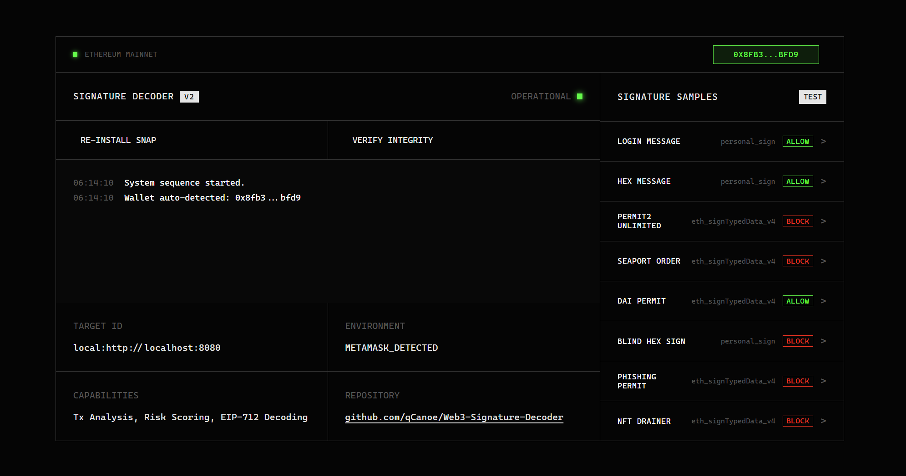
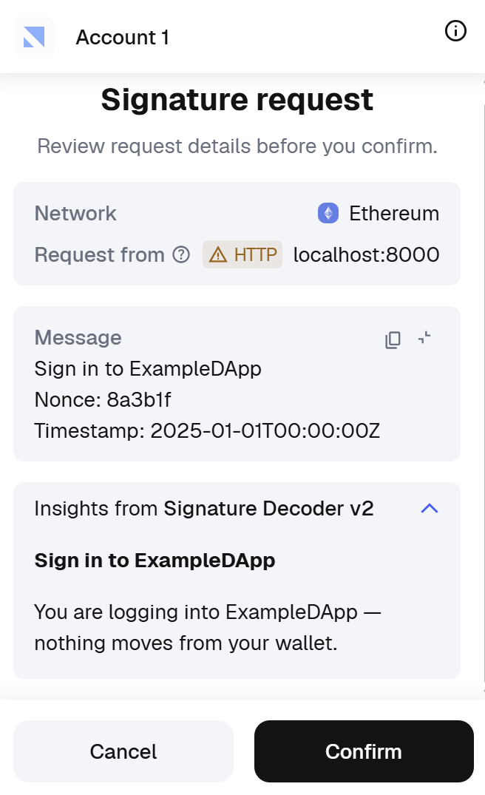
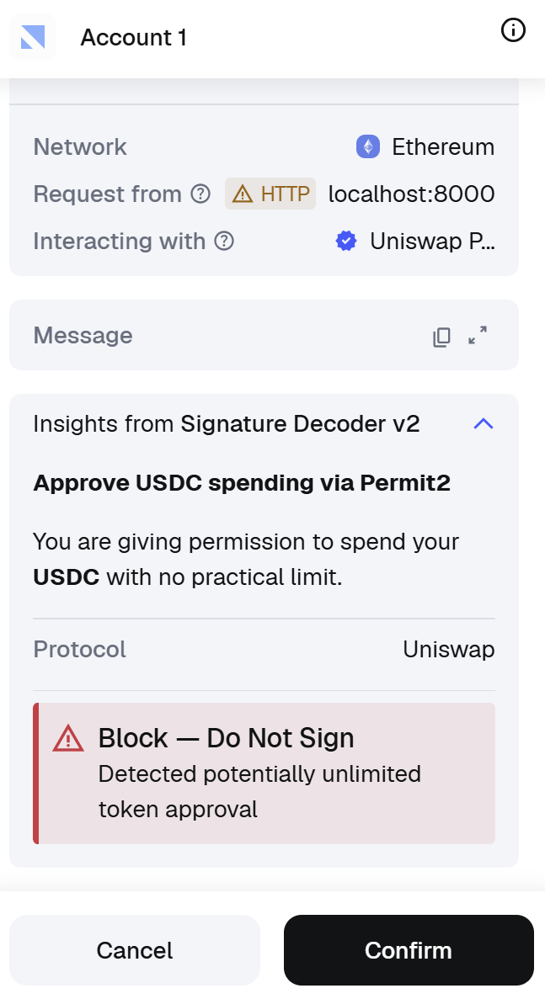

# Web3 Signature Decoder

A TypeScript monorepo that analyzes Ethereum signature requests and transactions in real time, providing human-readable risk assessments before users approve potentially dangerous operations.







## Background

When users interact with dApps through wallets like MetaMask, they are frequently prompted to sign messages or approve transactions. These requests are presented as raw hex data or opaque typed structures that most users cannot interpret. Malicious dApps exploit this information asymmetry to trick users into signing unlimited token approvals, phishing permits, or other harmful operations.

Signature Decoder addresses this problem by intercepting signature and transaction requests, running them through a multi-stage analysis pipeline, and returning structured risk assessments with clear explanations. It combines deterministic rule-based analysis with LLM reasoning to produce decisions that are both reliable and contextually rich.

The v2 architecture is a complete rewrite from the original Python backend and standalone Snap v1 implementation. The core analysis logic is now a single TypeScript package shared across all consumers (MetaMask Snap, REST API, test harness), eliminating logic duplication and ensuring consistent behavior.

## Architecture

### Monorepo layout

```
signature-decoder-v2/
├── packages/                    # Shared libraries
│   ├── core-schema/             # Zod schemas and shared types
│   ├── core-knowledge/          # Knowledge base loader (selectors, protocols, risk rules)
│   ├── core-llm/                # LLM provider abstraction (OpenAI, gateway, mock)
│   ├── core-engine/             # Analysis pipeline orchestrator
│   ├── core-renderers/          # MetaMask Snap UI renderers (JSX)
│   ├── test-fixtures/           # Golden test fixtures with schema validation
│   └── test-harness/            # Contract, schema, and integration tests
├── apps/                        # Deployable applications
    │   ├── snap/                    # MetaMask Snap (uses core-engine with pluggable LLM provider)
    │   ├── site/                    # Project landing page and Snap initialization UI
    │   ├── test-api/                # Express REST API for development and testing
    │   └── test-web/                # Browser-based test shell
├── package.json                 # Workspace root (npm workspaces)
└── tsconfig.base.json           # Shared TypeScript configuration
```

### Package dependency graph

```
@sd/core-schema          (no internal dependencies; defines all Zod schemas)
       |
       ├── @sd/core-knowledge    (loads and validates knowledge JSON bundles)
       ├── @sd/core-llm          (LLM provider interface + OpenAI/gateway/mock impls)
       |
       └── @sd/core-engine       (pipeline orchestrator; depends on schema, knowledge, llm)
               |
               └── @sd/core-renderers   (Snap JSX UI; depends on schema only)
```

All inter-package references use npm workspaces. The build order is enforced in the root `build` script to ensure correct compilation sequence.

### Analysis pipeline

The core engine processes every request through a five-stage pipeline:

```
Request ──> Normalize ──> Parse ──> Enrich ──> LLM Reason ──> Risk Score ──> Result
```

1. **Normalize** -- Validates the incoming request against `AnalyzeRequestV2Schema` (Zod). Sets defaults (e.g., timestamp) and rejects malformed input early.
2. **Parse** -- Dispatches to method-specific parsers based on the signing method:

   - `eth_signTypedData_v4`: Extracts `primaryType`, domain name, verifying contract, message fields, token amounts, and actor addresses from the EIP-712 structure.
   - `eth_sendTransaction`: Extracts `from`, `to`, `value`, calldata, and the 4-byte function selector.
   - `personal_sign`: Decodes hex-encoded messages to UTF-8 and extracts the plaintext content.
   - `eth_sign`: Extracts the raw data hash.

   The parser also generates `highlights` (key-value pairs surfaced to the user) and collects `actors` (addresses found in the payload with inferred roles).
3. **Enrich** -- Augments the parsed request with knowledge-based inferences:

   - Matches the function selector against a known selector database to resolve the action name (for example, `0x095ea7b3` -> `token_approval`).
   - Matches `primaryType` against known EIP-712 type patterns (Permit, Permit2, Order, etc.).
   - Detects protocols by matching domain names and contract addresses against protocol pattern rules.
   - Checks for high-risk patterns: unlimited approvals (amount >= MAX_UINT256 / 2), batch operations (multicall selector `0xac9650d8`), and message content matching personal sign risk patterns.
   - Emits deterministic risk signals with severity levels and human-readable reasons.
4. **LLM Reason** -- Sends a structured prompt to the configured LLM provider containing parsed and enriched context (including domain/address threat-intel hits and chain risk hints). The provider returns a two-stage payload:

   - `detect`: action/protocol/riskSignals
   - `explain`: one-sentence user-facing description

   The response is validated and normalized by `LlmReasoningResponseSchema`, which also supports backward-compatible top-level fields (`action`, `description`, etc.).
5. **Risk Score** -- Merges deterministic (knowledge-based) and LLM-generated risk signals, then applies LLM-primary decision logic:

   - The LLM's `riskLevel` and `decision` are used directly as the primary output.
   - LLM risk signals are appended as incremental signals (knowledge-covered keys are not duplicated).
   - If the LLM is unavailable, deterministic knowledge signals drive escalation: critical signals (`infinite_allowance`, threat intel hits) force `block`; all other cases return `error`.

### Fail-closed policy

If the LLM provider is unavailable, times out, or returns an invalid response, the engine returns an `error` decision with `policyReason: "analysis_unavailable"` — indicating that the risk level could not be determined. The engine never silently defaults to `allow`.

**Deterministic escalation**: When the LLM is unavailable but the knowledge base has already detected a critical signal (`infinite_allowance`, `malicious_address_hit`, `malicious_domain_hit`, or `phishing_domain`), the engine escalates to `block` with `policyReason: "high_risk"`. This ensures that known threats are still blocked even when LLM reasoning is offline.

### Risk scoring

The engine uses a **LLM-primary** scoring model:

- The LLM is the primary decision-maker. It returns `riskLevel` (`low` / `medium` / `high` / `critical`) and `decision` (`allow` / `block`) directly. The engine uses these values without further weight accumulation.
- Risk scores are mapped from the LLM's `riskLevel`: `low` → 15, `medium` → 50, `high` → 75, `critical` → 95.
- If the LLM does not return a `riskLevel` (backward-compatibility mode), the engine derives a level from the severity of LLM risk signals and threat intel hits.
- The knowledge base (selectors, EIP-712 types, protocols, threat intel) feeds structured context into the LLM prompt as pre-computed signals, improving LLM judgment without replacing it.
- Knowledge-derived signals (`source: "knowledge"`) are always included in `risk.signals` for transparency. LLM-derived signals (`source: "llm"`) are appended for keys not already covered by the knowledge base.
- The `decision` is `allow`, `block`, or `error` (LLM unavailable, no critical knowledge signal).

### LLM provider abstraction

The `@sd/core-llm` package defines a `ReasoningProvider` interface with three implementations:

| Provider                     | Use case                                     | Configuration                       |
| ---------------------------- | -------------------------------------------- | ----------------------------------- |
| `OpenAiReasoningProvider`  | Direct OpenAI API calls                      | API key, model, timeout             |
| `GatewayReasoningProvider` | HTTP gateway (e.g., test-api `/v2/reason`) | URL, optional bearer token, timeout |
| `MockReasoningProvider`    | Deterministic testing                        | Fixed response object               |

Current default wiring in this repo initializes Snap with `OpenAiReasoningProvider` directly. `GatewayReasoningProvider` remains available for deployments that prefer a server-side gateway (`/v2/reason`) and token-based control.

### Two-stage LLM response format

The preferred LLM output is:

```json
{
  "detect": {
    "action": "token_approval",
    "protocol": "Uniswap",
    "confidence": 0.78,
    "riskSignals": [
      {
        "key": "suspicious_calldata",
        "reason": "Calldata includes obfuscated target",
        "severity": "medium"
      }
    ]
  },
  "explain": {
    "description": "This request may grant token spending approval."
  }
}
```

Backward-compatible top-level aliases are still accepted (`action`, `description`, `protocol`, `confidence`, `riskSignals`).

### Knowledge base

The knowledge base is a set of versioned JSON files (`v2`) loaded at startup and validated against Zod schemas:

| File                         | Content                                                        |
| ---------------------------- | -------------------------------------------------------------- |
| `selectors.v2.json`        | 4-byte function selector to action name mapping                |
| `eip712_types.v2.json`     | Known EIP-712 primary types and their risk characteristics     |
| `protocols.v2.json`        | Protocol detection rules (domain patterns, contract addresses) |
| `risk_rules.v2.json`       | Risk signal definitions with severity levels and weights       |
| `message_patterns.v2.json` | Regex patterns for personal_sign message content analysis      |
| `malicious_addresses.v2.json` | Static malicious address intelligence (category/severity/reason) |
| `malicious_domains.v2.json` | Static malicious domain intelligence (category/severity/reason) |
| `chains.v2.json` | Chain-specific risk features (approve/permit/upgrade/proxy patterns) |

The knowledge singleton is initialized lazily and can be reset for testing.

## Supported signing methods

| Method                   | EIP                                            | Description                                                   |
| ------------------------ | ---------------------------------------------- | ------------------------------------------------------------- |
| `eth_signTypedData_v4` | [EIP-712](https://eips.ethereum.org/EIPS/eip-712) | Structured typed data signing (Permit, Permit2, orders, etc.) |
| `eth_sendTransaction`  | --                                             | Transaction submission with calldata                          |
| `personal_sign`        | [EIP-191](https://eips.ethereum.org/EIPS/eip-191) | Plaintext or hex-encoded message signing                      |
| `eth_sign`             | --                                             | Raw hash signing (highest inherent risk)                      |

## Getting started

### Prerequisites

- **Node.js**: >= 20.11.0
- **npm**: >= 10
- **MetaMask Flask**: Recommended for Snap development

### Installation

```bash
git clone https://github.com/qCanoe/Web3-Signature-Decoder.git
cd Web3-Signature-Decoder
npm install
```

### Configuration

Copy the example environment file and add your OpenAI API key:

```bash
cp .env.example .env
# Edit .env and set OPENAI_API_KEY
```

### Development

The fastest way to get started is to run the local development environment, which starts both the MetaMask Snap and the companion site:

```bash
npm run dev
```

- **Snap**: Running at `http://localhost:8080`
- **Site**: Open `http://localhost:8000` to install and test the Snap

### Other Commands

- **Build**: `npm run build` (compiles all packages in dependency order)
- **Test**: `npm run test` (runs harness and snap tests)
- **API Server**: `npm run dev:test-api` (standalone analysis API)
- **Web Shell**: `npm run dev:test-web` (fixture-based testing UI)

## Development

### Test API server

The test API provides HTTP endpoints for exercising the analysis pipeline without a MetaMask wallet:

```bash
npm run dev:test-api
```

Endpoints:

| Method   | Path                      | Description                                                |
| -------- | ------------------------- | ---------------------------------------------------------- |
| `GET`  | `/v2/health`            | Health check; returns LLM model and status                 |
| `POST` | `/v2/analyze`           | Accepts `AnalyzeRequestV2`, returns `AnalysisResultV2` |
| `POST` | `/v2/fixtures/validate` | Runs all golden fixtures and reports pass/fail             |
| `POST` | `/v2/reason`            | LLM reasoning gateway (used by Snap)                       |

### Test web shell

A browser-based UI for submitting requests, loading fixtures, and viewing results:

```bash
npm run dev:test-web
```

Open `http://localhost:4173` in a browser. The web shell connects to the test API at the configured base URL.

### MetaMask Snap

```bash
npm run dev:snap
```

The Snap registers `onSignature` and `onTransaction` handlers that intercept wallet operations, run them through the core engine, and display risk assessments in the MetaMask UI.

### Project Site

```bash
npm run dev:site
```

A landing page and initialization UI for the Snap. Open `http://localhost:8000` after starting.

## Environment variables

Copy `.env.example` to `.env` and configure:

| Variable                  | Required | Default                             | Description                                       |
| ------------------------- | -------- | ----------------------------------- | ------------------------------------------------- |
| `OPENAI_API_KEY`        | Yes      | --                                  | OpenAI API key for LLM reasoning                  |
| `OPENAI_MODEL`          | No       | `gpt-5.2`                         | Model identifier for OpenAI completions           |
| `OPENAI_TIMEOUT_MS`     | No       | `12000`                           | Request timeout in milliseconds                   |
| `TEST_API_HOST`         | No       | `0.0.0.0`                         | Test API bind address                             |
| `TEST_API_PORT`         | No       | `4000`                            | Test API listen port                              |
| `TEST_WEB_HOST`         | No       | `0.0.0.0`                         | Test web shell bind address                       |
| `TEST_WEB_PORT`         | No       | `4173`                            | Test web shell listen port                        |
| `TEST_WEB_API_BASE_URL` | No       | `http://localhost:4000`           | API URL used by the web shell                     |
| `SNAP_GATEWAY_URL`      | No       | `http://localhost:4000/v2/reason` | Gateway endpoint called by Snap for LLM reasoning |
| `SNAP_GATEWAY_TOKEN`    | No       | --                                  | Optional bearer token for gateway authentication  |

## Testing strategy

The test suite is organized into several categories:

- **Schema tests** (`schema.test.ts`): Validates that `AnalyzeRequestV2Schema` correctly accepts valid inputs and rejects invalid kind/method combinations.
- **Contract tests** (`contract.test.ts`): Verifies that `CoreEngine.analyze()` output conforms to `AnalysisResultV2Schema`.
- **Fail-closed tests** (`fail_closed.test.ts`): Confirms that LLM provider failures result in `block` decisions with appropriate error metadata.
- **Fixture tests** (`fixtures.test.ts`): Runs golden fixtures through the pipeline and asserts expected decisions.
- **LLM adapter tests** (`llm_adapter.test.ts`): Tests LLM provider behavior and response parsing.
- **Signal mapping tests** (`signal_mapping.test.ts`): Verifies LLM taxon normalization, incremental merge, and source-cap scoring behavior.
- **Snap tests** (`index.test.ts`): Unit tests for the MetaMask Snap handlers.

## Tech stack

| Component         | Technology                      |
| ----------------- | ------------------------------- |
| Language          | TypeScript 5.7 (ES2022 target)  |
| Monorepo          | npm workspaces                  |
| Schema validation | Zod 3.24                        |
| Testing           | Vitest 2.1, Jest (Snap)         |
| LLM               | OpenAI API (configurable model) |
| Snap SDK          | MetaMask Snaps SDK 6.22         |
| API server        | Express 5                       |
| Build             | tsc (per-package)               |

## Legacy code

The `legacy-python-src/`, `legacy-python-tests/`, `legacy-snap-v1/`, and `legacy-requirements.txt` contain the previous Python backend and Snap v1 implementation. These are preserved for reference but are not used by the v2 runtime.

## License

See [LICENSE](LICENSE) for details.
