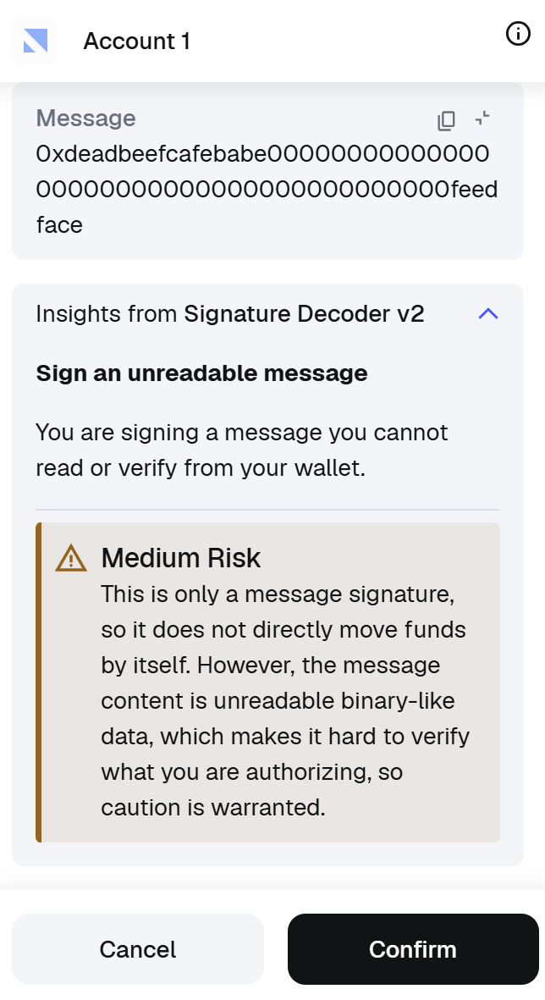
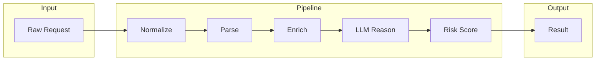
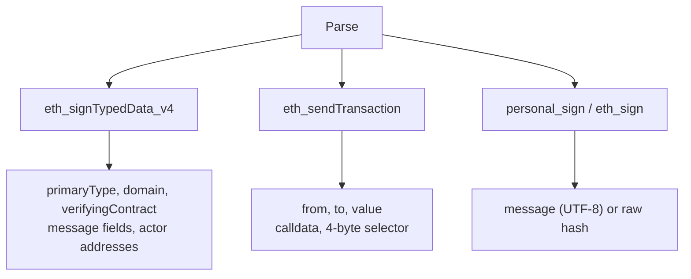

# Web3 Signature Decoder

[](https://nodejs.org)
[](https://www.typescriptlang.org)
[](https://www.npmjs.com)

A TypeScript monorepo that analyzes Ethereum signature requests and transactions in real time, providing human-readable risk assessments before users approve potentially dangerous operations.

[Background](#background) • [Features](#features) • [Getting started](#getting-started) • [Architecture](#architecture) • [Development](#development)


<table width="100%">
  <tr>
    <td width="33.33%"></td>
    <td width="33.33%"></td>
    <td width="33.33%"></td>
  </tr>
</table>


## Background

When users interact with dApps through wallets like MetaMask, they are frequently prompted to sign messages or approve transactions. These requests are presented as raw hex data or opaque typed structures that most users cannot interpret. Malicious dApps exploit this information asymmetry to trick users into signing unlimited token approvals, phishing permits, or other harmful operations.

Signature Decoder intercepts signature and transaction requests, runs them through a multi-stage analysis pipeline, and returns structured risk assessments with clear explanations. It combines deterministic rule-based analysis with LLM reasoning for reliable, context-aware decisions. The v2 architecture is a complete rewrite with a single TypeScript core shared across MetaMask Snap, REST API, and test harness.

## Features

- **Real-time analysis** — Intercepts requests before user approval, providing instant risk assessments
- **Multi-method support** — Handles `eth_signTypedData_v4`, `eth_sendTransaction`, `personal_sign`, and `eth_sign`
- **Hybrid reasoning** — Deterministic rules plus LLM for reliable, context-aware decisions
- **Fail-closed security** — Never silently defaults to allow; blocks or errors when risk cannot be determined
- **Knowledge base** — Selector database, EIP-712 patterns, protocol detection, threat intelligence (addresses/domains)
- **MetaMask Snap** — Native integration displaying human-readable insights in the wallet UI
- **Pluggable LLM** — OpenAI, HTTP gateway, or mock provider for flexible deployment

## Getting started

### Prerequisites

- **Node.js** >= 20.11.0
- **npm** >= 10
- **MetaMask Flask** — Recommended for Snap development

### Installation

```bash
git clone https://github.com/qCanoe/Web3-Signature-Decoder.git
cd Web3-Signature-Decoder
npm install
```

### Configuration

Copy the example environment file and add your OpenAI API key:

```bash
cp .env.example .env
# Edit .env and set OPENAI_API_KEY
```

> [!IMPORTANT]
> An OpenAI API key is required for LLM reasoning. Without it, the engine will return `error` decisions when analysis cannot be completed.

### Quick start

The fastest way to run the project:

```bash
npm run dev
```

This starts the MetaMask Snap, test API, and companion site. Open `http://localhost:8000` to install and test the Snap.

## Architecture

### Monorepo layout

```
Web3-Signature-Decoder/
├── packages/                    # Shared libraries
│   ├── core-schema/             # Zod schemas and shared types
│   ├── core-knowledge/          # Knowledge base loader (selectors, protocols, risk rules)
│   ├── core-llm/                # LLM provider abstraction (OpenAI, gateway, mock)
│   ├── core-engine/             # Analysis pipeline orchestrator
│   ├── core-renderers/          # MetaMask Snap UI renderers (JSX)
│   ├── test-fixtures/           # Golden test fixtures with schema validation
│   └── test-harness/            # Contract, schema, and integration tests
├── apps/                        # Deployable applications
│   ├── snap/                    # MetaMask Snap (uses core-engine with pluggable LLM provider)
│   ├── site/                    # Project landing page and Snap initialization UI
│   ├── test-api/                # Express REST API for development and testing
│   └── test-web/                # Browser-based test shell
├── package.json                 # Workspace root (npm workspaces)
└── tsconfig.base.json           # Shared TypeScript configuration
```

### Analysis pipeline

The core engine processes every request through a five-stage pipeline. Each stage transforms the data and passes it to the next.




**Stage details:**


| Stage          | Input                | Output               | Key actions                                                                         |
| -------------- | -------------------- | -------------------- | ----------------------------------------------------------------------------------- |
| **Normalize**  | Raw JSON/hex payload | `AnalyzeRequestV2`   | Zod schema validation, defaults (timestamp), reject malformed input early           |
| **Parse**      | Normalized request   | `ParsedRequest`      | Method dispatch → extract structured fields, highlights, actors                     |
| **Enrich**     | Parsed request       | `EnrichedRequest`    | Selector lookup, EIP-712 type match, protocol detection, threat intel, risk signals |
| **LLM Reason** | Enriched context     | `detect` + `explain` | Structured prompt → action, protocol, riskSignals, user-facing description          |
| **Risk Score** | Enriched + LLM       | `AnalysisResultV2`   | Merge signals, LLM-primary decision, fail-closed on LLM error                       |


**Parse stage — method dispatch:**



**Enrich stage — knowledge lookups:**

- **Selector DB** → `0x095ea7b3` → `token_approval`
- **EIP-712 types** → Permit, Permit2, Order patterns
- **Protocols** → Domain + contract address → Uniswap, OpenSea, etc.
- **Threat intel** → `malicious_addresses.v2.json`, `malicious_domains.v2.json`
- **Risk patterns** → Unlimited approval (amount ≥ MAX_UINT256/2), multicall (`0xac9650d8`), message regex

**Risk Score — decision logic:**

- LLM returns `riskLevel` (low/medium/high/critical) and `decision` (allow/block) → used directly
- Knowledge signals (`source: "knowledge"`) + LLM signals (`source: "llm"`) merged into `risk.signals`
- **Fail-closed**: LLM unavailable → `error` with `policyReason: "analysis_unavailable"`
- **Deterministic escalation**: LLM unavailable + critical knowledge signal → `block` with `policyReason: "high_risk"`

> [!NOTE]
> When the LLM is unavailable but the knowledge base detects a critical signal (`infinite_allowance`, `malicious_address_hit`, `malicious_domain_hit`, `phishing_domain`), the engine escalates to `block` with `policyReason: "high_risk"`.

### Supported signing methods


| Method                 | EIP     | Description                                     |
| ---------------------- | ------- | ----------------------------------------------- |
| `eth_signTypedData_v4` | EIP-712 | Structured typed data (Permit, Permit2, orders) |
| `eth_sendTransaction`  | —       | Transaction submission with calldata            |
| `personal_sign`        | EIP-191 | Plaintext or hex-encoded message signing        |
| `eth_sign`             | —       | Raw hash signing (highest inherent risk)        |


## Development

### Test API server

```bash
npm run dev:test-api
```


| Method | Path                    | Description                                |
| ------ | ----------------------- | ------------------------------------------ |
| GET    | `/v2/health`            | Health check; returns LLM model and status |
| POST   | `/v2/analyze`           | Accepts `AnalyzeRequestV2`, returns result |
| POST   | `/v2/fixtures/validate` | Runs golden fixtures, reports pass/fail    |
| POST   | `/v2/reason`            | LLM reasoning gateway (used by Snap)       |


### Test web shell

```bash
npm run dev:test-web
```

Open `http://localhost:4173` for a browser-based UI to submit requests, load fixtures, and view results.

### MetaMask Snap

```bash
npm run dev:snap
```

Registers `onSignature` and `onTransaction` handlers that intercept wallet operations and display risk assessments.

### Project site

```bash
npm run dev:site
```

Landing page and Snap initialization UI at `http://localhost:8000`.

### Other commands

- **Build**: `npm run build` — Compiles all packages in dependency order
- **Test**: `npm run test` — Runs harness and Snap tests

## Environment variables


| Variable                | Required | Default                           | Description                       |
| ----------------------- | -------- | --------------------------------- | --------------------------------- |
| `OPENAI_API_KEY`        | Yes      | —                                 | OpenAI API key for LLM reasoning  |
| `OPENAI_MODEL`          | No       | `gpt-5.2`                         | Model identifier                  |
| `OPENAI_TIMEOUT_MS`     | No       | `12000`                           | Request timeout (ms)              |
| `TEST_API_HOST`         | No       | `0.0.0.0`                         | Test API bind address             |
| `TEST_API_PORT`         | No       | `4000`                            | Test API port                     |
| `TEST_WEB_HOST`         | No       | `0.0.0.0`                         | Web shell bind address            |
| `TEST_WEB_PORT`         | No       | `4173`                            | Web shell port                    |
| `TEST_WEB_API_BASE_URL` | No       | `http://localhost:4000`           | API URL used by web shell         |
| `SNAP_GATEWAY_URL`      | No       | `http://localhost:4000/v2/reason` | Gateway endpoint for Snap         |
| `SNAP_GATEWAY_TOKEN`    | No       | —                                 | Optional bearer token for gateway |


## Tech stack


| Component         | Technology                |
| ----------------- | ------------------------- |
| Language          | TypeScript 5.7 (ES2022)   |
| Monorepo          | npm workspaces            |
| Schema validation | Zod 3.24                  |
| Testing           | Vitest 2.1, Jest (Snap)   |
| LLM               | OpenAI API (configurable) |
| Snap SDK          | MetaMask Snaps SDK 6.22   |
| API server        | Express 5                 |
| Build             | tsc (per-package)         |


## Potential roadmap

- **Knowledge base expansion** — Broaden selector coverage, EIP-712 types, protocol patterns for emerging DeFi/NFT
- **Multi-chain support** — Chain-specific risk rules and threat intelligence (L2s, EVM-compatible)
- **Local LLM option** — Self-hosted or local LLM providers for privacy-sensitive deployments
- **Snap distribution** — Publish to MetaMask Snaps directory for one-click installation
- **Enhanced semantic output** — Richer natural language descriptions and structured field visualization

